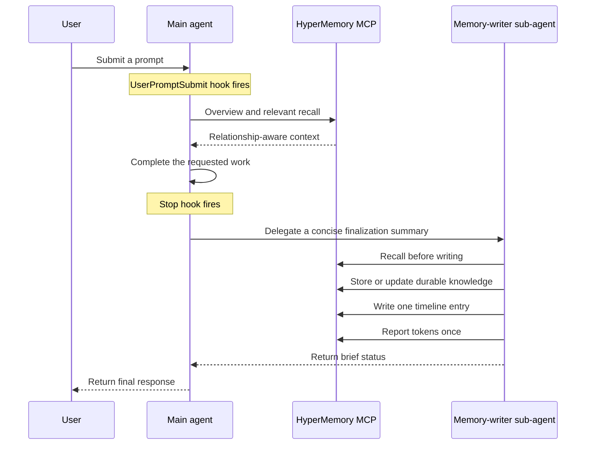
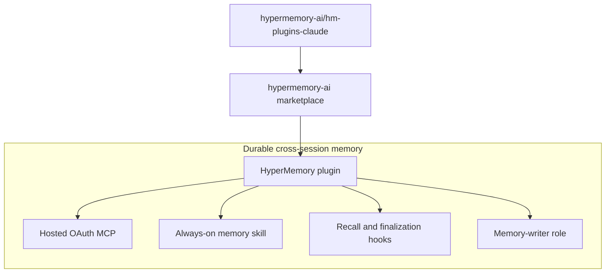

<p align="center">
  
</p>

<h1 align="center">HyperMemory AI plugin for Claude Code</h1>

<p align="center">
  Durable, relationship-aware memory for every conversation.<br />
  Automatic recall before every response. Background persistence after every turn.
</p>

<p align="center">
  <a href="LICENSE"></a>
  
</p>

> [!IMPORTANT]
> This repository is the Git-backed development marketplace for Claude Code.
> HyperMemory currently connects to the Rust staging MCP at
> `https://stage.hypermemory.io/mcp`. Public, one-click installation for normal
> Claude Code users requires separate publication through Anthropic's plugin
> marketplace.

## Contents

- [What this repository provides](#what-this-repository-provides)
- [Capability matrix](#capability-matrix)
- [Supported surfaces](#supported-surfaces)
- [Quick start](#quick-start)
- [HyperMemory](#hypermemory)
- [Architecture](#architecture)
- [Repository layout](#repository-layout)
- [Authentication and secrets](#authentication-and-secrets)
- [Updating](#updating)
- [Removing](#removing)
- [Development](#development)
- [Troubleshooting](#troubleshooting)
- [Frequently asked questions](#frequently-asked-questions)
- [Documentation](#documentation)
- [Support and security](#support-and-security)

## What this repository provides

This repository is one plugin marketplace containing one installable Claude Code
plugin:

| Plugin | Current version | Purpose |
| --- | ---: | --- |
| **HyperMemory** | `0.1.0` | Persistent personal and project memory, relationship-aware recall, delegated background writes, timeline logging, and token telemetry |

The marketplace is named `hypermemory-ai`. A marketplace is a catalog and
source of plugins; registering it does **not** install the plugin. Users add
the marketplace once, then install HyperMemory.

```text
GitHub repository                      Marketplace              Installable plugin
hypermemory-ai/hm-plugins-claude   ->  hypermemory-ai       ->  hypermemory
```

## Capability matrix

| Capability | HyperMemory |
| --- | :---: |
| Hosted OAuth MCP | Yes |
| Bundled skill | Yes (v0.6.6 software-development) |
| Claude Code lifecycle hooks | Yes |
| Packaged sub-agent role contract | Memory writer |
| Relationship-aware graph | Personal and cross-session |
| Chronological timeline | Conversation and decision timeline |
| Weighted activity segmentation | Yes |
| Works without other plugins | Yes |

## Supported surfaces

| Surface | HyperMemory |
| --- | --- |
| Claude Code CLI | Full behavior after MCP authorization and hook trust |
| Claude Code Desktop app | Full behavior — shares plugin config with CLI |
| Claude Desktop (Electron app) | MCP only — no hooks, agents, or skills; best-effort via CLAUDE.md |
| claude.ai (web) | MCP only — same limitations as Claude Desktop |

## Quick start

### Prerequisites

- Claude Code CLI or Claude Code Desktop app
- A HyperMemory account

### 1. One-step install

```bash
/install hypermemory-ai/hm-plugins-claude
```

Or register the marketplace and install separately:

```bash
/plugin marketplace add hypermemory-ai/hm-plugins-claude
/plugin install hypermemory
```

Complete the HyperMemory OAuth flow when prompted, then start a new session.

### 2. Review and trust hooks

In Claude Code, run:

```text
/hooks
```

Review each hook definition and trust the hooks you want to run. Claude Code
does not automatically trust non-managed plugin hooks. Trust is tied to the
exact hook definition, so changed hooks require review again after an update.

### 3. Verify the installation

Try these prompts in a new session:

```text
What do you remember about this project?
```

```text
What do you know about me?
```

## HyperMemory

HyperMemory adds durable, relationship-aware memory to Claude Code. It is
designed to recall the right context before a response and preserve important
knowledge after the requested work is complete.

### Included components

| Component | Path | Responsibility |
| --- | --- | --- |
| Plugin manifest | `.claude-plugin/plugin.json` | Identity, version, discovery metadata, and MCP declaration |
| Marketplace catalog | `.claude-plugin/marketplace.json` | Marketplace registration and plugin listing |
| MCP configuration | `.mcp.json` | Connects to the hosted Rust staging MCP over HTTP |
| Skill | `skills/hypermemory/SKILL.md` | v0.6.6 software-development protocol — recall, graph hygiene, delegation, timeline, and telemetry behavior |
| Lifecycle hooks | `hooks/hooks.json` | Reinforces recall at prompt submission and finalization at stop |
| Memory-writer role | `agents/memory-writer.md` | Bounded contract for delegated storage, timeline, and telemetry work |

### Turn lifecycle



The main agent performs recall because remembered context must be available
while reasoning about the user's request. Persistence and telemetry are moved
to one awaited memory-writer sub-agent to keep the main context focused. The
role contract prevents recursive delegation.

### Memory operations

The skill uses the HyperMemory MCP for:

- graph overview and relevant recall;
- exact-node hydration and relationship traversal;
- durable storage and correction of existing knowledge;
- graph relationships and orphan cleanup;
- chronological timeline entries;
- user-requested file storage; and
- per-turn token telemetry.

The hosted MCP currently exposes these tool families:

| Area | Tools |
| --- | --- |
| Recall and context | `hm_get_overview`, `hm_recall`, `hm_get_nodes`, `hm_get_chat_context`, `hm_find_related` |
| Graph writes and hygiene | `hm_store`, `hm_update`, `hm_forget`, `hm_add_relationships`, `hm_ingest`, `hm_list_orphans` |
| Timeline | `hm_timeline`, `hm_timeline_write` |
| Files | `hm_upload_file`, `hm_list_files` |
| Skill distribution | `hm_skill` |
| Telemetry | `hm_tokens` |

Writes follow canonical node types and stable keys. The writer recalls before
changing the graph, updates existing nodes instead of duplicating them, and
gives each new node a specific relationship. File upload is used only when the
user explicitly asks to store a file.

### OAuth and credentials

The plugin connects to:

```text
https://stage.hypermemory.io/mcp
```

The server supports authorization-code OAuth, PKCE S256, refresh tokens, and
dynamic client registration. The plugin package contains the server URL only;
it does not contain or require a checked-in API key.

### Always-on behavior and its boundary

HyperMemory uses three complementary layers:

1. The skill declares itself applicable on every turn with `enforcement: mandatory` and `trigger: every_turn`.
2. The `UserPromptSubmit` hook reminds the active agent to recall before work.
3. The `Stop` hook requires delegated memory finalization before the response is
   released.

This is the strongest enforcement available to an installed plugin, but it is
not an operating-system guarantee. If the plugin is disabled, its hooks are not
trusted, hooks are disabled by policy, the MCP is unavailable, or the current
surface cannot spawn sub-agents, behavior degrades accordingly. The skill
defines a direct-write fallback when delegation is unavailable so memory is not
silently abandoned.

## Architecture



## Repository layout

```text
.
├── .claude-plugin/
│   ├── marketplace.json        # Marketplace catalog
│   └── plugin.json             # HyperMemory manifest
├── .mcp.json                   # Hosted OAuth MCP connection
├── agents/
│   └── memory-writer.md        # Memory-writer role contract
├── assets/
│   ├── icon.png                # Marketplace icon
│   └── logo.png                # Marketplace logo
├── hooks/
│   └── hooks.json              # Claude Code lifecycle hooks
├── skills/
│   └── hypermemory/
│       └── SKILL.md            # v0.6.6 software-development protocol
├── LICENSE                     # MIT license
└── README.md
```

Only `plugin.json` and `marketplace.json` live inside `.claude-plugin/`. Skills,
MCP configuration, hooks, assets, and role contracts remain at the plugin root
according to the Claude Code plugin package layout.

## Agent role packaging

The plugin contains an `agents/` role contract and a matching skill reference.
HyperMemory uses `memory-writer` for storage, timeline, and telemetry.

This file documents the bounded role that the skill asks the host to spawn. It
is not a separate manifest-level custom-agent registry. The skill controls when
delegation happens, what information is passed, and how recursive delegation is
prevented.

## Authentication and secrets

| Component | Authentication | Where credentials live |
| --- | --- | --- |
| HyperMemory MCP | OAuth authorization code with PKCE | Claude Code MCP credential storage |
| Git marketplace | Public GitHub repository | No credentials required for this repository |

No access token, refresh token, client secret, API key, or reviewer credential
belongs in this repository. See [Security](SECURITY.md) for reporting and trust
boundaries.

## Hook trust and permissions

Plugin installation does not automatically trust bundled hooks. Users must
review them with `/hooks`. This provides an explicit boundary around prompts
that can invoke recall or spawn background agents.

Administrators may disable hooks or restrict marketplace/MCP sources through
managed Claude Code policy. Sub-agents inherit the active parent sandbox and
permission mode. The plugin does not expand operating-system permissions on its
own.

## Updating

Refresh the Git marketplace snapshot, reinstall, and start a new session:

```bash
/plugin marketplace upgrade hypermemory-ai
/plugin install hypermemory
```

Review hooks again if their definitions changed.

## Removing

```bash
/plugin remove hypermemory
/plugin marketplace remove hypermemory-ai
```

Removing the plugin or marketplace does not delete durable data already stored
by HyperMemory.

## Development

### Clone

```bash
git clone https://github.com/hypermemory-ai/hm-plugins-claude.git
cd hm-plugins-claude
```

### Test a local marketplace checkout

In a clean development profile, or after removing another configured source
with the same marketplace name, run from the repository root:

```bash
/plugin marketplace add .
/plugin install hypermemory
```

Start a new session after reinstalling so Claude Code loads the updated skills
and MCP configuration.

## Troubleshooting

### The marketplace was added, but the plugin is not installed

That is expected. Registering the marketplace adds the catalog only. Install the
plugin explicitly:

```bash
/plugin install hypermemory
```

### MCP tools are missing

Confirm that the plugin is installed and enabled with `/plugin list`, then
start a new session.

### HyperMemory OAuth did not open

Invoke a HyperMemory MCP operation and complete the connection flow. Confirm
the installed MCP URL is `https://stage.hypermemory.io/mcp` and check whether a
workspace policy blocks the server.

### Hooks do not run

Open `/hooks`, locate the plugin hook source, and trust its current definition.
Also confirm hooks are not disabled in Claude Code configuration or managed
policy.

### The plugin changed but Claude Code still uses the old copy

Refresh and reinstall:

```bash
/plugin marketplace upgrade hypermemory-ai
/plugin install hypermemory
```

Then start a new session. Claude Code loads an installed marketplace snapshot
rather than executing directly from an arbitrary source checkout.

## Frequently asked questions

### Is the marketplace itself a plugin?

No. The marketplace is the catalog named `hypermemory-ai`. It currently lists
the `hypermemory` plugin.

### Are the hooks automatically trusted?

No. Claude Code requires explicit trust for non-managed plugin hooks, and
changed definitions must be reviewed again.

### Is the packaged `agents/` file an automatically registered custom agent?

No. It is a bounded role contract invoked through the bundled skill. It
documents delegation behavior but is not a separate manifest-level agent
registry.

### Can a normal Claude Desktop user install directly from this Git URL?

Claude Desktop does not support plugins. Users can manually add the MCP server
in Desktop settings and use a project-level `CLAUDE.md` file for best-effort
recall/write behavior.

### Is the MCP endpoint production?

No. The checked-in HyperMemory configuration currently targets the Rust staging
endpoint. Treat the package as pre-production until the manifest and docs are
updated to a production MCP URL.

## Documentation

- [HyperMemory](https://hypermemory.io) — Product homepage
- [Security policy](SECURITY.md) — Vulnerability reporting and boundaries

For the current Claude Code plugin model, see Anthropic's
[plugin documentation](https://docs.anthropic.com/en/docs/claude-code/plugins).

## Support and security

For general project questions, use the repository's GitHub issues. Do not post
credentials, tokens, private repository content, or vulnerability details in a
public issue.

Report security concerns privately according to [SECURITY.md](SECURITY.md).
Legal and product information is available at:

- [HyperMemory AI](https://hypermemory.io)
- [Privacy policy](https://hypermemory.io/privacy)
- [Terms of service](https://hypermemory.io/terms)

## License

Licensed under the MIT License. See [LICENSE](LICENSE).
