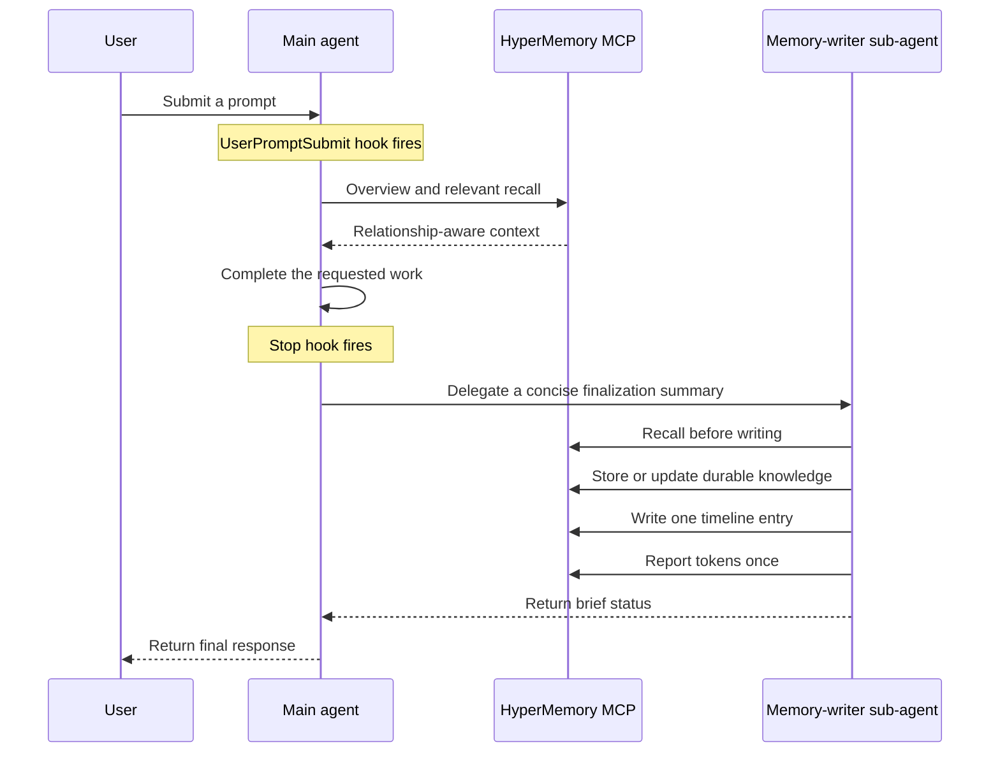
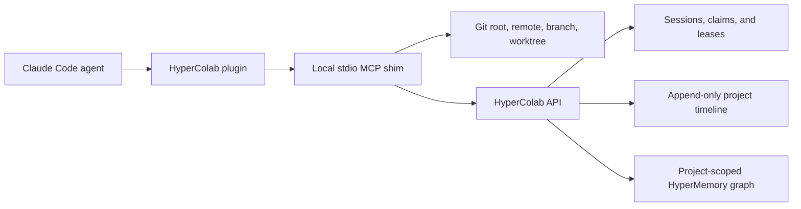
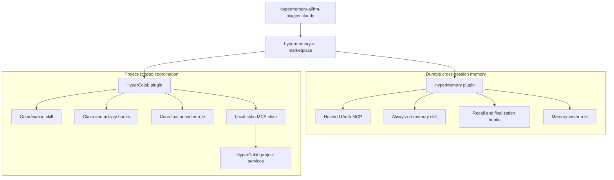

<p align="center">
  
  &nbsp;&nbsp;&nbsp;&nbsp;
  
</p>

<h1 align="center">HyperMemory AI plugins for Claude Code</h1>

<p align="center">
  Durable, relationship-aware memory for every conversation.<br />
  Shared project context and collision-safe coordination for every repository.
</p>

<p align="center">
  <a href="LICENSE"></a>
  
</p>

> [!IMPORTANT]
> This repository is the Git-backed development marketplace for Claude Code.
> HyperMemory currently connects to the Rust staging MCP at
> `https://stage.hypermemory.io/mcp`. Public, one-click installation for normal
> Claude Code users requires separate publication through Anthropic's plugin
> marketplace.

## Contents

- [What this repository provides](#what-this-repository-provides)
- [Why two plugins?](#why-two-plugins)
- [Capability matrix](#capability-matrix)
- [Supported surfaces](#supported-surfaces)
- [Quick start](#quick-start)
- [HyperMemory](#hypermemory)
- [HyperColab](#hypercolab)
- [Combined architecture](#combined-architecture)
- [Repository layout](#repository-layout)
- [Authentication and secrets](#authentication-and-secrets)
- [Updating](#updating)
- [Removing](#removing)
- [Development](#development)
- [Troubleshooting](#troubleshooting)
- [Frequently asked questions](#frequently-asked-questions)
- [Documentation](#documentation)
- [Support and security](#support-and-security)

## What this repository provides

This repository is one plugin marketplace containing two independently
installable Claude Code plugins:

| Plugin | Current version | Purpose |
| --- | ---: | --- |
| **HyperMemory** | `0.1.0` | Persistent personal and project memory, relationship-aware recall, delegated writes, timeline logging, and token telemetry |
| **HyperColab** | `0.1.0` | Shared project context, work ownership, path claims, project timelines, and multi-agent collision prevention |

The marketplace is named `hypermemory-ai`. A marketplace is a catalog and
source of plugins; registering it does **not** install either plugin. Users add
the marketplace once, then choose HyperMemory, HyperColab, or both.

```text
GitHub repository                      Marketplace              Installable plugins
hypermemory-ai/hm-plugins-claude   ->  hypermemory-ai       ->  hypermemory
                                                             ->  hypercolab
```

## Why two plugins?

HyperMemory and HyperColab share a graph-oriented foundation, but they solve
different problems and have different runtime boundaries:

- **HyperMemory follows a person or agent across conversations.** It recalls
  durable context before work begins and maintains that context after each
  turn.
- **HyperColab follows a Git project.** It resolves the active repository,
  coordinates concurrent developers and coding agents, protects claimed paths,
  and records a structured development timeline.

Keeping them separate lets a user install durable memory without repository
coordination, add coordination only where needed, or run both together.

## Capability matrix

| Capability | HyperMemory | HyperColab |
| --- | :---: | :---: |
| Hosted OAuth MCP | Yes | No |
| Local stdio MCP shim | No | Yes |
| Bundled skill | Yes | Yes |
| Claude Code lifecycle hooks | Yes | Yes |
| Packaged sub-agent role contract | Memory writer | Coordination writer |
| Relationship-aware graph | Personal and cross-session | Project-scoped |
| Chronological timeline | Conversation and decision timeline | Development activity timeline |
| Weighted activity segmentation | Yes | No |
| Path claims and collision protection | No | Yes |
| Git event capture | No | Optional |
| Works without the other plugin | Yes | Yes |

## Supported surfaces

| Surface | HyperMemory | HyperColab |
| --- | --- | --- |
| Claude Code CLI | Full behavior after MCP authorization and hook trust | Full behavior after CLI installation, login, plugin installation, and hook trust |
| Claude Code Desktop app | Full behavior — shares plugin config with CLI | Supported when the local environment can launch `hypercolab` and access the repository |
| Claude Desktop (Electron app) | MCP only — no hooks, agents, or skills; best-effort via CLAUDE.md | Skill can be tested; repository coordination requires a local process and Git checkout |
| claude.ai (web) | MCP only — same limitations as Claude Desktop | Local Git claims and activity capture are unavailable |

## Quick start

### Prerequisites

- Claude Code CLI or Claude Code Desktop app
- A HyperMemory account
- Git
- Python 3.10 or newer and [`pipx`](https://pipx.pypa.io/) for HyperColab

### 1. Register the marketplace

Run this once:

```bash
/plugin marketplace add hypermemory-ai/hm-plugins-claude
```

Confirm Claude Code can see it:

```bash
/plugin marketplace list
```

### 2. Install HyperMemory

```bash
/plugin install hypermemory
```

Complete the HyperMemory OAuth flow when prompted, then start a new session.

### 3. Install HyperColab

HyperColab needs its local CLI/MCP shim before Claude Code loads the plugin:

```bash
pipx install "git+https://github.com/hypermemory-ai/hm-plugins-claude.git#subdirectory=packages/hypercolab-cli"
hypercolab login
hypercolab doctor
/plugin install hypercolab
```

Start a new session inside a Git repository that is enrolled in HyperColab.

### 4. Review and trust hooks

In Claude Code, run:

```text
/hooks
```

Review each plugin's hook definition and trust the hooks you want to run. Claude
Code does not automatically trust non-managed plugin hooks. Trust is tied to the
exact hook definition, so changed hooks require review again after an update.

### 5. Verify the installation

```bash
/plugin list
hypercolab status
```

Try these prompts in a new session:

```text
What do you remember about this project?
```

```text
Join this HyperColab project, sync active work, and claim the files needed for my task.
```

## HyperMemory

HyperMemory adds durable, relationship-aware memory to Claude Code. It is
designed to recall the right context before a response and preserve important
knowledge after the requested work is complete.

### Included components

| Component | Path | Responsibility |
| --- | --- | --- |
| Plugin manifest | `plugins/hypermemory/.claude-plugin/plugin.json` | Identity, version, discovery metadata, and MCP declaration |
| MCP configuration | `plugins/hypermemory/.mcp.json` | Connects to the hosted Rust staging MCP over HTTP |
| Skill | `plugins/hypermemory/skills/hypermemory/` | v0.6.6 software-development protocol — recall, graph hygiene, delegation, timeline, and telemetry behavior |
| Lifecycle hooks | `plugins/hypermemory/hooks/hooks.json` | Reinforces recall at prompt submission and finalization at stop |
| Memory-writer role | `plugins/hypermemory/agents/memory-writer.md` | Bounded contract for delegated storage, timeline, and telemetry work |

### Turn lifecycle



The main agent performs recall because remembered context must be available
while reasoning about the user's request. Persistence and telemetry are moved
to one awaited memory-writer sub-agent to keep the main context focused. The
role contract prevents recursive delegation.

### Memory operations

The skill uses the HyperMemory MCP for:

- graph overview and relevant recall;
- exact-node hydration and relationship traversal;
- durable storage and correction of existing knowledge;
- graph relationships and orphan cleanup;
- chronological timeline entries;
- user-requested file storage; and
- per-turn token telemetry.

The hosted MCP currently exposes these tool families:

| Area | Tools |
| --- | --- |
| Recall and context | `hm_get_overview`, `hm_recall`, `hm_get_nodes`, `hm_get_chat_context`, `hm_find_related` |
| Graph writes and hygiene | `hm_store`, `hm_update`, `hm_forget`, `hm_add_relationships`, `hm_ingest`, `hm_list_orphans` |
| Timeline | `hm_timeline`, `hm_timeline_write` |
| Files | `hm_upload_file`, `hm_list_files` |
| Skill distribution | `hm_skill` |
| Telemetry | `hm_tokens` |

Writes follow canonical node types and stable keys. The writer recalls before
changing the graph, updates existing nodes instead of duplicating them, and
gives each new node a specific relationship. File upload is used only when the
user explicitly asks to store a file.

### OAuth and credentials

The plugin connects to:

```text
https://stage.hypermemory.io/mcp
```

The server supports authorization-code OAuth, PKCE S256, refresh tokens, and
dynamic client registration. The plugin package contains the server URL only;
it does not contain or require a checked-in API key.

### Always-on behavior and its boundary

HyperMemory uses three complementary layers:

1. The skill declares itself applicable on every turn with `enforcement: mandatory` and `trigger: every_turn`.
2. The `UserPromptSubmit` hook reminds the active agent to recall before work.
3. The `Stop` hook requires delegated memory finalization before the response is
   released.

This is the strongest enforcement available to an installed plugin, but it is
not an operating-system guarantee. If the plugin is disabled, its hooks are not
trusted, hooks are disabled by policy, the MCP is unavailable, or the current
surface cannot spawn sub-agents, behavior degrades accordingly. The skill
defines a direct-write fallback when delegation is unavailable so memory is not
silently abandoned.

## HyperColab

HyperColab coordinates human developers and coding agents working in the same
Git project. It combines shared context, explicit work ownership, atomic path
claims, structured activity, and project-scoped graph search.

### Included components

| Component | Path | Responsibility |
| --- | --- | --- |
| Plugin manifest | `plugins/hypercolab/.claude-plugin/plugin.json` | Identity, version, discovery metadata, and MCP declaration |
| MCP registration | `plugins/hypercolab/.mcp.json` | Launches `hypercolab mcp` as a local stdio server |
| Skill | `plugins/hypercolab/skills/hypercolab/` | Defines join, sync, claim, progress, activity, and completion behavior |
| Lifecycle hooks | `plugins/hypercolab/hooks/hooks.json` | Loads project context, checks writes, and records structured activity |
| Coordination-writer role | `plugins/hypercolab/agents/coordination-writer.md` | Bounded contract for delegated timeline maintenance |
| Hook launcher | `plugins/hypercolab/scripts/hypercolab_hook.py` | Bridges Claude Code lifecycle events to the installed CLI and degrades safely if absent |

### Why a local shim?

HyperColab must know which repository the user is actually working in. The
local shim derives the Git root, canonical remote, branch, and worktree before
calling the project service. Agents do not select arbitrary graph or timeline
database identifiers.



This routing is a safety boundary: the backend resolves the authorized project
from the authenticated developer and canonical repository identity.

### MCP tool reference

| Tool | Purpose |
| --- | --- |
| `colab_join` | Join the project associated with the current Git repository and publish the work goal |
| `colab_sync` | Retrieve active sessions, ownership, recent events, and touch/do-not-touch guidance |
| `colab_claim` | Atomically claim repository-relative files or directories before editing |
| `colab_check` | Check create, modify, rename, or delete operations immediately before a write |
| `colab_update` | Publish material progress, scope, status, rationale, and claim renewal |
| `colab_finish` | Complete, release, abandon, or hand off work and release the claim |
| `colab_log_activity` | Append a structured project event for decisions, discoveries, tests, commits, or releases |
| `colab_timeline` | Read or search the chronological development record |
| `colab_graph_search` | Search durable knowledge in the project-scoped graph |

### Coordination lifecycle

The main agent joins and synchronizes before planning, then claims intended
paths before editing. Join, sync, and claim operations stay on the main agent
because their results affect planning and write safety. Routine progress and
timeline maintenance may be delegated to one awaited coordination writer.

```text
join -> sync -> claim -> check before writes -> update during work -> finish or hand off
```

Live conflicts are not bypassed. If another session owns an overlapping path,
the agent coordinates a handoff, waits for lease expiry, or changes scope.

### Offline behavior

HyperColab treats coordination conservatively during an outage:

- new path claims fail closed;
- a previously approved cached lease is honored only until its server-issued
  expiration;
- Git activity is queued locally and retried later; and
- repositories that are not registered with HyperColab remain unaffected.

## Combined architecture



The plugins may be enabled independently. When both are enabled, HyperMemory
retains durable conversational context while HyperColab supplies the live,
repository-specific coordination state.

## Repository layout

```text
.
├── .claude-plugin/
│   └── marketplace.json                # Shared marketplace catalog
├── plugins/
│   ├── hypermemory/
│   │   ├── .claude-plugin/plugin.json  # HyperMemory manifest
│   │   ├── .mcp.json                   # Hosted OAuth MCP connection
│   │   ├── agents/                     # Memory-writer role contract
│   │   ├── assets/                     # Marketplace icon and logo
│   │   ├── hooks/hooks.json            # Claude Code lifecycle hooks
│   │   └── skills/hypermemory/         # Memory workflow and references
│   └── hypercolab/
│       ├── .claude-plugin/plugin.json  # HyperColab manifest
│       ├── .mcp.json                   # Local stdio MCP registration
│       ├── agents/                     # Coordination-writer role contract
│       ├── assets/                     # Marketplace icon and logo
│       ├── hooks/hooks.json            # Claude Code coordination hooks
│       ├── scripts/                    # Graceful hook launcher
│       └── skills/hypercolab/          # Coordination workflow and references
├── assets/                             # Shared logo assets
├── SECURITY.md                         # Vulnerability reporting and boundaries
├── LICENSE                             # MIT license
└── README.md
```

Only `plugin.json` lives inside each `.claude-plugin/` directory. Skills, MCP
configuration, hooks, assets, scripts, and role contracts remain at the plugin
root according to the Claude Code plugin package layout.

## Agent role packaging

Each plugin contains an `agents/` role contract and a matching skill reference:

- HyperMemory uses `memory-writer` for storage, timeline, and telemetry.
- HyperColab uses `coordination-writer` for project activity maintenance.

These files document the bounded role that the skill asks the host to spawn.
They are not a separate manifest-level custom-agent registry: the skill
controls when delegation happens, what information is passed, and how recursive
delegation is prevented.

## Authentication and secrets

| Component | Authentication | Where credentials live |
| --- | --- | --- |
| HyperMemory MCP | OAuth authorization code with PKCE | Claude Code MCP credential storage |
| HyperColab CLI | `hypercolab login` OAuth flow with PKCE | OS keyring, with a restricted local fallback when no keyring is available |
| Git marketplace | Public GitHub repository | No credentials required for this repository |

No access token, refresh token, client secret, API key, or reviewer credential
belongs in this repository. See [Security](SECURITY.md) for reporting and trust
boundaries.

## Hook trust and permissions

Plugin installation does not automatically trust bundled command hooks. Users
must review them with `/hooks`. This provides an explicit boundary around local
commands that can inspect token counters, query Git state, or check write
ownership.

Administrators may disable hooks or restrict marketplace/MCP sources through
managed Claude Code policy. Sub-agents inherit the active parent sandbox and
permission mode. Neither plugin expands operating-system permissions on its
own.

## Updating

Refresh the Git marketplace snapshot, reinstall the plugins you use, and start
a new session:

```bash
/plugin marketplace upgrade hypermemory-ai
/plugin install hypermemory
/plugin install hypercolab
pipx upgrade hypercolab
```

Review hooks again if their definitions changed.

## Removing

If you installed HyperColab Git hooks, remove those first while the CLI is still
available:

```bash
hypercolab hooks uninstall
```

Then remove the plugins, marketplace, and optional CLI:

```bash
/plugin remove hypermemory
/plugin remove hypercolab
/plugin marketplace remove hypermemory-ai
pipx uninstall hypercolab
```

Removing a plugin or marketplace does not delete durable data already stored by
HyperMemory or HyperColab.

## Development

### Clone

```bash
git clone https://github.com/hypermemory-ai/hm-plugins-claude.git
cd hm-plugins-claude
```

### Test a local marketplace checkout

In a clean development profile, or after removing another configured source
with the same marketplace name, run from the repository root:

```bash
/plugin marketplace add .
/plugin install hypermemory
/plugin install hypercolab
```

Start a new session after reinstalling so Claude Code loads the updated skills
and MCP configuration.

## Troubleshooting

### The marketplace was added, but no plugin is installed

That is expected. Registering the marketplace adds the catalog only. Install a
plugin explicitly:

```bash
/plugin install hypermemory
/plugin install hypercolab
```

### MCP tools are missing

Confirm that the plugin is installed and enabled with `/plugin list`, then
start a new session. HyperColab also requires the `hypercolab` executable to be
on `PATH`; run `hypercolab doctor` to verify its prerequisites.

### HyperMemory OAuth did not open

Invoke a HyperMemory MCP operation and complete the connection flow. Confirm
the installed MCP URL is `https://stage.hypermemory.io/mcp` and check whether a
workspace policy blocks the server.

### HyperColab authentication failed

Run:

```bash
hypercolab login
hypercolab doctor
hypercolab status
```

The local callback needs an available loopback port and a browser capable of
completing OAuth.

### Hooks do not run

Open `/hooks`, locate the plugin hook source, and trust its current definition.
Also confirm hooks are not disabled in Claude Code configuration or managed
policy.

### A HyperColab write is blocked

Run `hypercolab sync` to inspect active ownership and claims. Coordinate a
handoff, wait for the conflicting lease to expire, or change the intended path.
Do not bypass a valid ownership conflict.

### The plugin changed but Claude Code still uses the old copy

Refresh and reinstall:

```bash
/plugin marketplace upgrade hypermemory-ai
/plugin install <plugin-name>
```

Then start a new session. Claude Code loads an installed marketplace snapshot
rather than executing directly from an arbitrary source checkout.

## Frequently asked questions

### Is the marketplace itself a plugin?

No. The marketplace is the catalog named `hypermemory-ai`. It currently lists
the separate `hypermemory` and `hypercolab` plugins.

### Do I need both plugins?

No. HyperMemory and HyperColab are independent. Install only the capabilities
you need.

### Does HyperColab replace HyperMemory?

No. HyperColab uses project-scoped knowledge and coordination. HyperMemory is
the durable cross-conversation memory plugin. They complement one another.

### Are the hooks automatically trusted?

No. Claude Code requires explicit trust for non-managed plugin hooks, and
changed definitions must be reviewed again.

### Are the packaged `agents/` files automatically registered custom agents?

No. They are bounded role contracts invoked through the bundled skills. They
document delegation behavior but are not a separate manifest-level agent
registry.

### Can a normal Claude Desktop user install directly from this Git URL?

Claude Desktop does not support plugins. Users can manually add the HyperMemory
MCP server in Desktop settings and use a project-level `CLAUDE.md` file for
best-effort recall/write behavior.

### Is the MCP endpoint production?

No. The checked-in HyperMemory configuration currently targets the Rust staging
endpoint. Treat the package as pre-production until the manifest and docs are
updated to a production MCP URL.

## Documentation

- [HyperMemory](https://hypermemory.io) — Product homepage
- [Security policy](SECURITY.md) — Vulnerability reporting and boundaries

For the current Claude Code plugin model, see Anthropic's
[plugin documentation](https://docs.anthropic.com/en/docs/claude-code/plugins).

## Support and security

For general project questions, use the repository's GitHub issues. Do not post
credentials, tokens, private repository content, or vulnerability details in a
public issue.

Report security concerns privately according to [SECURITY.md](SECURITY.md).
Legal and product information is available at:

- [HyperMemory AI](https://hypermemory.io)
- [Privacy policy](https://hypermemory.io/privacy)
- [Terms of service](https://hypermemory.io/terms)

## License

Licensed under the MIT License. See [LICENSE](LICENSE).
