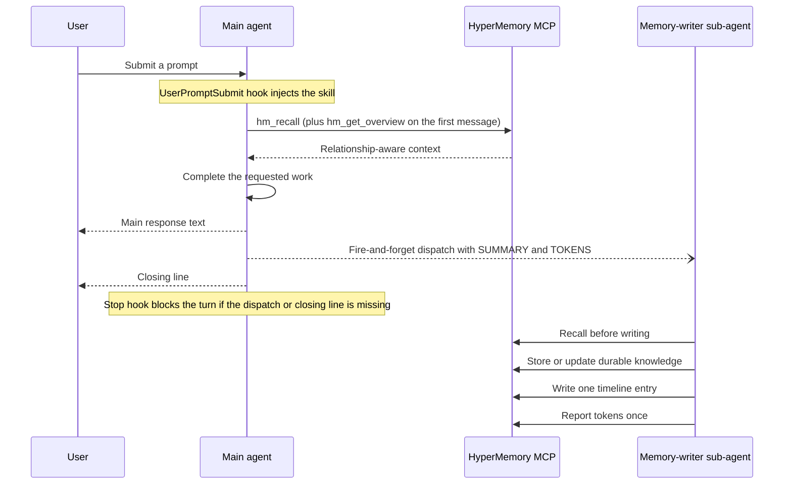
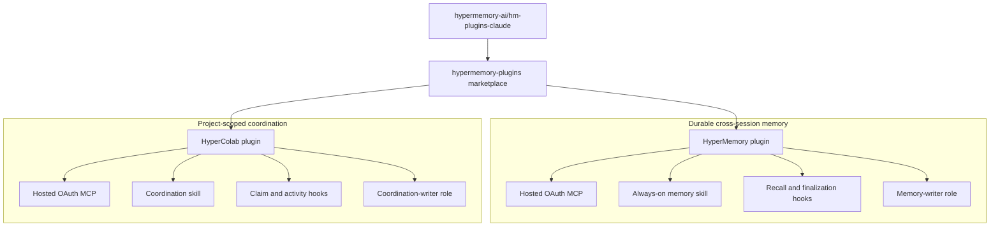

<p align="center">
  
  &nbsp;&nbsp;&nbsp;&nbsp;
  
</p>

<h1 align="center">HyperMemory AI plugins for Claude Code</h1>

<p align="center">
  Durable, relationship-aware memory for every conversation.<br />
  Shared project context and collision-safe coordination for every repository.
</p>

<p align="center">
  <a href="LICENSE"></a>
  
</p>

> [!IMPORTANT]
> This repository is the Git-backed marketplace for Claude Code.
> HyperMemory connects to the production MCP at `https://api.hypermemory.io/mcp`.
> HyperColab still connects to the staging MCP at
> `https://stage.hypermemory.io/colab/mcp` until a production endpoint exists.

## Contents

- [What this repository provides](#what-this-repository-provides)
- [Why two plugins?](#why-two-plugins)
- [Capability matrix](#capability-matrix)
- [Supported surfaces](#supported-surfaces)
- [Quick start](#quick-start)
- [HyperMemory](#hypermemory)
- [HyperColab](#hypercolab)
- [Combined architecture](#combined-architecture)
- [Repository layout](#repository-layout)
- [Agent role packaging](#agent-role-packaging)
- [Authentication and secrets](#authentication-and-secrets)
- [Hooks and permissions](#hooks-and-permissions)
- [Updating](#updating)
- [Removing](#removing)
- [Development](#development)
- [Troubleshooting](#troubleshooting)
- [Frequently asked questions](#frequently-asked-questions)
- [Documentation](#documentation)
- [Support and security](#support-and-security)

## What this repository provides

This repository is one plugin marketplace containing two independently
installable Claude Code plugins:

| Plugin | Current version | Purpose |
| --- | ---: | --- |
| **HyperMemory** | `2.15.0` | Persistent personal and project memory, relationship-aware recall, delegated writes, timeline logging, and token telemetry |
| **HyperColab** | `2.8.5` | Shared project context, work ownership, path claims, project timelines, and multi-agent collision prevention |

The marketplace is named `hypermemory-plugins`. A marketplace is a catalog and
source of plugins; registering it does **not** install either plugin. Users add
the marketplace once, then choose HyperMemory, HyperColab, or both.

```text
GitHub repository                      Marketplace              Installable plugins
hypermemory-ai/hm-plugins-claude   ->  hypermemory-plugins  ->  hypermemory
                                                             ->  hypercolab
```

## Why two plugins?

HyperMemory and HyperColab share a graph-oriented foundation, but they solve
different problems and have different runtime boundaries:

- **HyperMemory follows a person or agent across conversations.** It recalls
  durable context before work begins and maintains that context after each
  turn.
- **HyperColab follows a Git project.** It coordinates concurrent developers
  and coding agents, protects claimed paths, and records a structured
  development timeline.

Keeping them separate lets a user install durable memory without repository
coordination, add coordination only where needed, or run both together.

## Capability matrix

| Capability | HyperMemory | HyperColab |
| --- | :---: | :---: |
| Hosted OAuth MCP | Yes (production) | Yes (staging) |
| Bundled skill | Yes | Yes |
| Claude Code lifecycle hooks | Yes | Yes |
| Packaged sub-agent role contract | Memory writer | Coordination writer |
| Relationship-aware graph | Personal and cross-session | Project-scoped |
| Chronological timeline | Conversation and decision timeline | Development activity timeline |
| Weighted activity segmentation | Yes | No |
| Path claims and collision protection | No | Yes |
| Works without the other plugin | Yes | Yes |

## Supported surfaces

| Surface | HyperMemory | HyperColab |
| --- | --- | --- |
| Claude Code CLI | Full behavior after MCP authorization | Full behavior after MCP authorization |
| Claude Code Desktop app | Full behavior — shares plugin config with CLI | Full behavior — shares plugin config with CLI |
| Claude Desktop (Electron app) | MCP only — no hooks, agents, or skills; best-effort via CLAUDE.md | MCP only — same limitations as HyperMemory |
| claude.ai (web) | MCP only — same limitations as Claude Desktop | MCP only — same limitations as Claude Desktop |

## Quick start

### Prerequisites

- Claude Code CLI or Claude Code Desktop app
- A HyperMemory account
- `bash` and `python3` on the `PATH` (used by the HyperMemory hooks)

### 1. Register the marketplace

Run this once:

```bash
/plugin marketplace add hypermemory-ai/hm-plugins-claude
```

Confirm Claude Code can see it:

```bash
/plugin marketplace list
```

### 2. Install HyperMemory

```bash
/plugin install hypermemory@hypermemory-plugins
```

Complete the HyperMemory OAuth flow when prompted, then start a new session.

### 3. Install HyperColab

```bash
/plugin install hypercolab@hypermemory-plugins
```

Complete the HyperColab OAuth flow when prompted, then start a new session
inside a Git repository.

### 4. Review the hooks

A plugin's hooks run as soon as the plugin is enabled. To see them, run:

```text
/hooks
```

This opens a read-only list of every configured hook, labeled with its source.

### 5. Verify the installation

```bash
/plugin list
```

Try these prompts in a new session:

```text
What do you remember about this project?
```

```text
Join this HyperColab project, sync active work, and claim the files needed for my task.
```

## HyperMemory

HyperMemory adds durable, relationship-aware memory to Claude Code. It is
designed to recall the right context before a response and preserve important
knowledge after the requested work is complete.

### Included components

| Component | Path | Responsibility |
| --- | --- | --- |
| Plugin manifest | `plugins/hypermemory/.claude-plugin/plugin.json` | Identity, version, discovery metadata, and MCP declaration |
| MCP configuration | `plugins/hypermemory/.mcp.json` | Connects to the hosted production MCP over HTTP |
| Skill | `plugins/hypermemory/skills/hypermemory/` | v0.11.0 protocol — recall before every response, memory-writer dispatch with a sectioned SUMMARY (request, user rules, decisions, findings, done, changed old → new, corrections, details) and TOKENS block, and tool reference |
| Skill | `plugins/hypermemory/skills/memorize-full-chat/` | On-demand `/hypermemory:memorize-full-chat` — commits a whole conversation as one node per entity with peer cross-links |
| Lifecycle hooks | `plugins/hypermemory/hooks/hooks.json` | At session start, adds the HyperMemory block to the repository's `CLAUDE.md` if missing (`setup-claude-md.sh`); injects the full HyperMemory skill at session start and on every prompt (`inject-skill.sh`); blocks a turn from ending without a memory-writer dispatch followed by closing text (`require-writer.py`) — see [docs/enforcement-hooks.md](plugins/hypermemory/docs/enforcement-hooks.md) |
| Memory-writer role | `plugins/hypermemory/agents/memory-writer.md` | Bounded contract for delegated storage, timeline, and telemetry work |

### Turn lifecycle


```mermaid
sequenceDiagram
    participant U as User
    participant M as Main agent
    participant MCP as HyperMemory MCP
    participant W as Memory-writer sub-agent

    U->>M: Submit a prompt
    Note over M: UserPromptSubmit hook injects the skill
    M->>MCP: hm_recall (plus hm_get_overview on the first message)
    MCP-->>M: Relationship-aware context
    M->>M: Complete the requested work
    M-->>U: Main response text
    M--)W: Fire-and-forget dispatch with SUMMARY and TOKENS
    M-->>U: Closing line
    Note over M: Stop hook blocks the turn if the dispatch or closing line is missing
    W->>MCP: Recall before writing
    W->>MCP: Store or update durable knowledge
    W->>MCP: Write one timeline entry
    W->>MCP: Report tokens once
```

The main agent performs recall because remembered context must be available
while reasoning about the user's request. Persistence and telemetry run in a
fire-and-forget background memory-writer sub-agent so the main response is
never delayed. The dispatch is never the last action: the main agent always
follows it with a closing line. The role contract prevents recursive
delegation.

### Memory operations

The skill uses the HyperMemory MCP for:

- graph overview and relevant recall;
- exact-node hydration and relationship traversal;
- durable storage and correction of existing knowledge;
- graph relationships and orphan cleanup;
- chronological timeline entries;
- user-requested file storage; and
- per-turn token telemetry.

The hosted MCP currently exposes these tool families:

| Area | Tools |
| --- | --- |
| Recall and context | `hm_get_overview`, `hm_recall`, `hm_get_nodes`, `hm_get_chat_context`, `hm_find_related` |
| Graph writes and hygiene | `hm_store`, `hm_update`, `hm_forget`, `hm_add_relationships`, `hm_ingest`, `hm_list_orphans` |
| Timeline | `hm_timeline`, `hm_timeline_write` |
| Files | `hm_upload_file`, `hm_list_files` |
| Structured data | `hm_tabular` |
| Skill distribution | `hm_skill` |
| Telemetry | `hm_tokens` |

All eighteen are the tools the server advertises through `tools/list`.

Writes follow canonical node types and stable keys. The writer recalls before
changing the graph, updates existing nodes instead of duplicating them, and
gives each new node a specific relationship. File upload is used only when the
user explicitly asks to store a file.

### OAuth and credentials

The plugin connects to:

```text
https://api.hypermemory.io/mcp
```

The server supports authorization-code OAuth, PKCE S256, refresh tokens, and
dynamic client registration. The plugin package contains the server URL only;
it does not contain or require a checked-in API key.

### Always-on behavior and its boundary

HyperMemory uses three complementary layers:

1. The skill declares itself applicable on every turn with `enforcement: mandatory` and `trigger: every_turn`.
2. The `SessionStart` and `UserPromptSubmit` hooks inject the full skill text,
   so it is in context at session start, after compaction, and on every prompt.
3. The `Stop` hook refuses to let a turn end until the main agent has
   dispatched the `hypermemory:memory-writer` agent and written a closing line
   after it. Short greetings and acknowledgements are exempt.

This is the strongest enforcement available to an installed plugin, but it is
not an operating-system guarantee. If the plugin is disabled, hooks are
disabled by policy, the MCP is unavailable, or the current surface cannot spawn
sub-agents, behavior degrades accordingly. The main agent never writes to the
graph itself, so on a surface without sub-agents nothing is persisted.

## HyperColab

HyperColab coordinates human developers and coding agents working in the same
Git project. It combines shared context, explicit work ownership, atomic path
claims, structured activity, and project-scoped graph search.

### Included components

| Component | Path | Responsibility |
| --- | --- | --- |
| Plugin manifest | `plugins/hypercolab/.claude-plugin/plugin.json` | Identity, version, discovery metadata, and MCP declaration |
| MCP configuration | `plugins/hypercolab/.mcp.json` | Connects to the hosted staging HyperColab MCP over HTTP |
| Skill | `plugins/hypercolab/skills/hypercolab/` | Defines join, sync, claim, progress, activity, and completion behavior |
| Lifecycle hooks | `plugins/hypercolab/hooks/hooks.json` | Prints instructions to the agent: join and sync at session start, check and claim ownership before `Edit`, `Write`, or `NotebookEdit`, and dispatch a coordination writer at stop |
| Coordination-writer role | `plugins/hypercolab/agents/coordination-writer.md` | Bounded contract for delegated timeline maintenance |

### MCP tool reference

| Tool | Purpose |
| --- | --- |
| `hm_colab_resolve` | Map a repository remote URL to a HyperColab project without joining |
| `hm_colab_join` | Join the project associated with the current Git repository and start a coordination session |
| `hm_colab_sync` | Retrieve active sessions, claims, touch/do-not-touch paths, and recent timeline events |
| `hm_colab_claim` | Claim repository-relative files or directories before editing; returns approved or blocked with conflicts |
| `hm_colab_check` | Check whether planned file operations conflict with other agents' claims, optionally auto-claiming free paths |
| `hm_colab_update` | Report progress, refresh the claim lease, and log a timeline event |
| `hm_colab_finish` | Finish work on a claim, release it, and record the outcome, changed files, and commits |
| `hm_colab_activity` | Log a freeform project event such as a decision, discovery, test result, or release |
| `hm_colab_timeline` | Query the project timeline by actor, kind, branch, path, or full-text search |

These nine tools match the server's HyperColab API contract.

### Coordination lifecycle

The main agent joins and synchronizes before planning, then claims intended
paths before editing. Join, sync, and claim operations stay on the main agent
because their results affect planning and write safety. Routine progress and
timeline maintenance may be delegated to one awaited coordination writer.

```text
join -> sync -> claim -> check before writes -> update during work -> finish or hand off
```

Live conflicts are not bypassed. If another session owns an overlapping path,
the agent coordinates a handoff, waits for lease expiry, or changes scope.

### OAuth and credentials

The plugin connects to:

```text
https://stage.hypermemory.io/colab/mcp
```

This is the staging endpoint. Production does not serve a HyperColab MCP yet,
so the plugin stays on staging until it does.

The server supports the same OAuth flow as HyperMemory: authorization-code
with PKCE S256, refresh tokens, and dynamic client registration. The plugin
package contains the server URL only; it does not contain or require a
checked-in API key.

### Data boundary

HyperColab records structured summaries, repository-relative paths, commit
identifiers, claims, statuses, test results, small metadata objects, and visible
rationale summaries. By default it does not send raw source, raw diffs, full
shell output, complete transcripts, or hidden model reasoning.

## Combined architecture


```mermaid
flowchart TB
    Repo["hypermemory-ai/hm-plugins-claude"] --> Catalog["hypermemory-plugins marketplace"]
    Catalog --> HM["HyperMemory plugin"]
    Catalog --> HC["HyperColab plugin"]

    subgraph PersonalMemory["Durable cross-session memory"]
        HM --> HMMCP["Hosted OAuth MCP"]
        HM --> HMSkill["Always-on memory skill"]
        HM --> HMHooks["Recall and finalization hooks"]
        HM --> HMAgent["Memory-writer role"]
    end

    subgraph ProjectCoordination["Project-scoped coordination"]
        HC --> HCMCP["Hosted OAuth MCP"]
        HC --> HCSkill["Coordination skill"]
        HC --> HCHooks["Claim and activity hooks"]
        HC --> HCAgent["Coordination-writer role"]
    end
```

The plugins may be enabled independently. When both are enabled, HyperMemory
retains durable conversational context while HyperColab supplies the live,
repository-specific coordination state.

## Repository layout

```text
.
├── .claude-plugin/
│   └── marketplace.json                # Shared marketplace catalog
├── plugins/
│   ├── hypermemory/
│   │   ├── .claude-plugin/plugin.json  # HyperMemory manifest
│   │   ├── .mcp.json                   # Production OAuth MCP connection
│   │   ├── agents/                     # Memory-writer role contract
│   │   ├── assets/                     # Marketplace icon and logo
│   │   ├── docs/                       # Enforcement hook design notes
│   │   ├── hooks/                      # hooks.json and its three hook scripts
│   │   ├── skills/hypermemory/         # Memory protocol
│   │   └── skills/memorize-full-chat/  # Whole-chat commit to the graph
│   └── hypercolab/
│       ├── .claude-plugin/plugin.json  # HyperColab manifest
│       ├── .mcp.json                   # Staging OAuth MCP connection
│       ├── agents/                     # Coordination-writer role contract
│       ├── assets/                     # Marketplace icon and logo
│       ├── hooks/hooks.json            # Claude Code coordination hooks
│       └── skills/hypercolab/          # Coordination workflow and references
├── assets/                             # Shared logo assets
├── SECURITY.md                         # Vulnerability reporting and boundaries
├── LICENSE                             # MIT license
└── README.md
```

Only `plugin.json` lives inside each `.claude-plugin/` directory. Skills, MCP
configuration, hooks, assets, and role contracts remain at the plugin root
according to the Claude Code plugin package layout.

## Agent role packaging

Each plugin contains an `agents/` role contract and a matching skill reference:

- HyperMemory uses `memory-writer` for storage, timeline, and telemetry.
- HyperColab uses `coordination-writer` for project activity maintenance.

These files document the bounded role that the skill asks the host to spawn.
They are not a separate manifest-level custom-agent registry: the skill
controls when delegation happens, what information is passed, and how recursive
delegation is prevented.

## Authentication and secrets

| Component | Authentication | Where credentials live |
| --- | --- | --- |
| HyperMemory MCP | OAuth authorization code with PKCE | Claude Code MCP credential storage |
| HyperColab MCP | OAuth authorization code with PKCE | Claude Code MCP credential storage |
| Git marketplace | Public GitHub repository | No credentials required for this repository |

No access token, refresh token, client secret, API key, or reviewer credential
belongs in this repository. See [Security](SECURITY.md) for reporting and trust
boundaries.

## Hooks and permissions

A plugin's hooks are merged with the user's and project's hooks and run as soon
as the plugin is enabled. `/hooks` lists them read-only, labeled with their
source. To stop a plugin's hooks, disable or uninstall the plugin.

Administrators may block plugin hooks (for example with
`allowManagedHooksOnly`) or restrict marketplace/MCP sources through managed
Claude Code policy. Sub-agents inherit the active parent sandbox and
permission mode. Neither plugin expands operating-system permissions on its
own.

## Updating

Refresh the Git marketplace snapshot, reinstall the plugins you use, and start
a new session:

```bash
/plugin marketplace update hypermemory-plugins
/plugin update hypermemory@hypermemory-plugins
/plugin update hypercolab@hypermemory-plugins
```

HyperMemory 2.12.2 and later connect to production. Users who signed in with an
earlier version authorized the staging server, so complete the OAuth flow again
when prompted.

## Removing

```bash
/plugin remove hypermemory@hypermemory-plugins
/plugin remove hypercolab@hypermemory-plugins
/plugin marketplace remove hypermemory-plugins
```

Removing a plugin or marketplace does not delete durable data already stored by
HyperMemory or HyperColab.

## Development

### Clone

```bash
git clone https://github.com/hypermemory-ai/hm-plugins-claude.git
cd hm-plugins-claude
```

### Test a local marketplace checkout

In a clean development profile, or after removing another configured source
with the same marketplace name, run from the repository root:

```bash
/plugin marketplace add .
/plugin install hypermemory@hypermemory-plugins
/plugin install hypercolab@hypermemory-plugins
```

Start a new session after reinstalling so Claude Code loads the updated skills
and MCP configuration.

## Troubleshooting

### The marketplace was added, but no plugin is installed

That is expected. Registering the marketplace adds the catalog only. Install a
plugin explicitly:

```bash
/plugin install hypermemory@hypermemory-plugins
/plugin install hypercolab@hypermemory-plugins
```

### MCP tools are missing

Confirm that the plugin is installed and enabled with `/plugin list`, then
start a new session.

### HyperMemory OAuth did not open

Invoke a HyperMemory MCP operation and complete the connection flow. Confirm
the installed MCP URL is `https://api.hypermemory.io/mcp` and check whether a
workspace policy blocks the server.

### HyperColab OAuth did not open

Invoke a HyperColab MCP operation and complete the connection flow. Confirm
the installed MCP URL is `https://stage.hypermemory.io/colab/mcp` and check
whether a workspace policy blocks the server.

### Hooks do not run

Open `/hooks` and confirm the plugin's hooks are listed. If they are missing,
confirm the plugin is enabled with `/plugin list` and start a new session. Also
confirm hooks are not disabled in Claude Code configuration or managed policy.
The HyperMemory hooks need `bash` and `python3` on the `PATH`.

### A HyperColab write is blocked

Call `colab_sync` to inspect active ownership and claims. Coordinate a handoff,
wait for the conflicting lease to expire, or change the intended path. Do not
bypass a valid ownership conflict.

### The plugin changed but Claude Code still uses the old copy

Refresh and reinstall:

```bash
/plugin marketplace update hypermemory-plugins
/plugin update <plugin-name>@hypermemory-plugins
```

Then start a new session. Claude Code loads an installed marketplace snapshot
rather than executing directly from an arbitrary source checkout.

## Frequently asked questions

### Is the marketplace itself a plugin?

No. The marketplace is the catalog named `hypermemory-plugins`. It currently lists
the separate `hypermemory` and `hypercolab` plugins.

### Do I need both plugins?

No. HyperMemory and HyperColab are independent. Install only the capabilities
you need.

### Does HyperColab replace HyperMemory?

No. HyperColab uses project-scoped knowledge and coordination. HyperMemory is
the durable cross-conversation memory plugin. They complement one another.

### Do the hooks run automatically?

Yes. A plugin's hooks run whenever the plugin is enabled, unless managed policy
blocks plugin hooks. Disable the plugin to stop them.

### Are the packaged `agents/` files automatically registered custom agents?

No. They are bounded role contracts invoked through the bundled skills. They
document delegation behavior but are not a separate manifest-level agent
registry.

### Can a normal Claude Desktop user install directly from this Git URL?

Claude Desktop does not support plugins. Users can manually add the MCP servers
in Desktop settings and use a project-level `CLAUDE.md` file for best-effort
behavior.

### Is the MCP endpoint production?

HyperMemory, yes: it targets `https://api.hypermemory.io/mcp`. HyperColab, no:
it still targets the staging endpoint `https://stage.hypermemory.io/colab/mcp`
because production does not serve a HyperColab MCP yet.

## Documentation

- [HyperMemory](https://hypermemory.io) — Product homepage
- [Security policy](SECURITY.md) — Vulnerability reporting and boundaries

For the current Claude Code plugin model, see Anthropic's
[plugin documentation](https://docs.anthropic.com/en/docs/claude-code/plugins).

## Support and security

For general project questions, use the repository's GitHub issues. Do not post
credentials, tokens, private repository content, or vulnerability details in a
public issue.

Report security concerns privately according to [SECURITY.md](SECURITY.md).
Legal and product information is available at:

- [HyperMemory AI](https://hypermemory.io)
- [Privacy policy](https://hypermemory.io/privacy)
- [Terms of service](https://hypermemory.io/terms)

## License

Licensed under the MIT License. See [LICENSE](LICENSE).
